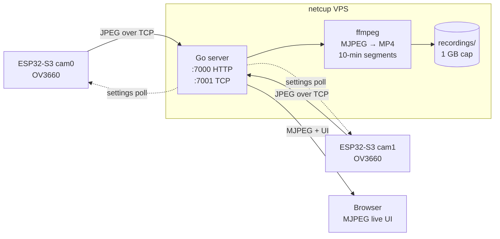
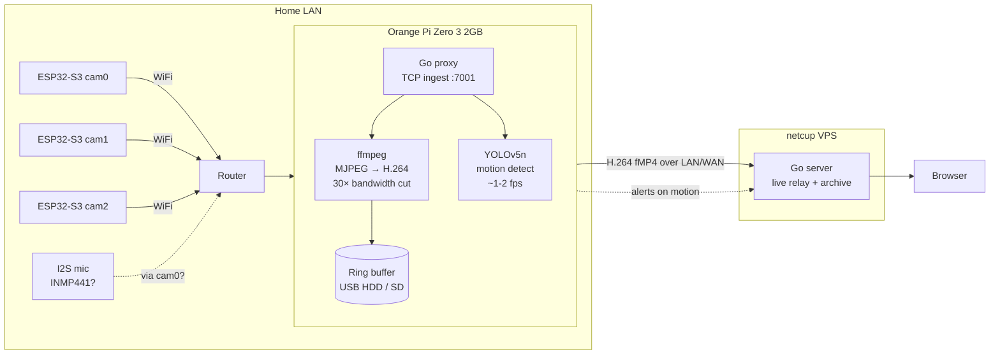

# Architecture

## Current (direct to server)



## Target (Pi aggregator on LAN)



## Data flow per frame (target)

```
OV3660 sensor
    ↓ parallel DVP bus
ESP32-S3 JPEG encoder (hardware)
    ↓ persistent TCP
Orange Pi Go proxy
    ↓ pipe
ffmpeg (HW H.264 via Cedrus/V4L2)
    ├→ local ring buffer (USB disk)
    ├→ YOLO inference (every Nth frame)
    └→ upload stream to netcup
```

## Why a Pi in the middle

| Concern              | Direct to VPS       | Pi aggregator             |
|----------------------|---------------------|---------------------------|
| Bandwidth to VPS     | ~24 Mbps / cam MJPEG | ~1 Mbps / cam H.264       |
| Survives WAN outage  | no (drops frames)   | yes (local ring buffer)   |
| Motion detection     | needs VPS CPU       | runs locally, free        |
| Single point of upload | per-cam WiFi→WAN  | one wired LAN→WAN link   |
| Added complexity     | none                | one more box to maintain  |
